# Behind the Screen : Poker game
---
# Behind the Screen : Poker game

## Summary

  * Poker hand matching
  * 7 cards
  * Faking the hands

---
# Behind the Screen : Poker game

## Poker hand matching

### Basics

  * Sort cards per value
  * Count cards per value
    * Will be used for pairs, three and four of a kind
  * Count cards per color
    * For flush
  * Check for flush
  * Check for straight
  * Check for four of a kind
  * Check for full house
  * Check for three of a kind
  * Check for double pair
  * Check for pair

Just follow the order and return the match

---
# Behind the Screen : Poker game

## Poker hand matching

### Ace value issue

First handled as 1

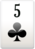

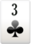
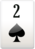

Special case for value 14

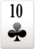

If 4 consecutive cards from K to 10 and Ace is found followed by Ace then :
Straight has been found.

Then all Aces handled as 14. Ace is always higher in pairs, three of a kind, etc...

This looked fine until... 7 cards!

---
# Behind the Screen : Poker game

## 7 cards

### New issues

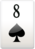
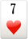
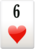

There is a straight but no 4 consecutive cards.

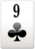
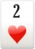

5 consecutive cards + Aces that could complete the straight

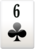

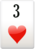

There is a straight but maybe also a flush!

Need something to help...

---
# Behind the Screen : Poker game

## 7 cards

### Tags

---
# Behind the Screen : Poker game

## Faking the hands

Goal : Win X points in Y hands.

Is previous code useless?

No, use random as :

    while(totalPoints != pointsToWin)
    {
        totalPoints = 0;
        cards = getRandomCards();
        totalPoints = findHand(cards).value;
    }
